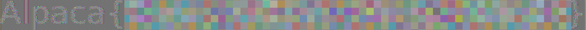
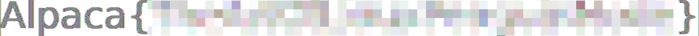

# AES is dead

## 問題

AESは最も安全な暗号の1つだと聞きました。 さすがに凄腕ハッカーもお手上げですよね？
```py
import os, re
from Crypto.Cipher import AES
from Crypto.Util.Padding import pad
from PIL import Image, ImageDraw, ImageFont

flag = os.getenv('FLAG', 'Alpaca{REDACTED}')
assert re.match(r"^Alpaca\{[A-Za-z]+\}$", flag)

# Generate image
font = ImageFont.truetype("DejaVuSans.ttf", 128)
draw = ImageDraw.Draw(Image.new("RGB", (1, 1), "white"))
left, top, right, bottom = draw.textbbox((0, 0), flag, font=font)

img = Image.new("RGB", (right - left, bottom - top), "white")
draw = ImageDraw.Draw(img)
draw.text((-left, -top), flag, fill="black", font=font)

img.save("flag.bmp")

# Encrypt image
key = os.urandom(16)
aes = AES.new(key, AES.MODE_ECB)

data = pad(open("flag.bmp", "rb").read(), 16)
open("flag.enc", "wb").write(aes.encrypt(data))

os.unlink("flag.bmp")
```

## 概要

前半で、フラグの文字列が描かれたBMP画像を生成し、後半でその画像データをAESで暗号化してファイル`flag.enc`に保存しているようです。

キーは全くわからないので復号できません。どうすればフラグを取れるのでしょうか？

## 方針

AES暗号のモードがECBモードであることに注目する。

## 解法

ECBモードについては、2/12の過去問`AAAAAAAAEEEEEEEESSSSSSSS`でも取り扱われていましたよね。

このモードでは、ブロックサイズ(16バイト)ごとに単純に暗号化を行います。

前のブロックやカウンタに依存しないので、同じ平文からは必ず同じ暗号文が生成されます。

さて、BMP画像ファイルのバイナリは通常次のような構造になっています。
```
--------------------------
ファイルヘッダー(14バイト)
--------------------------
情報ヘッダー(原則40バイト)
--------------------------
カラーパレット(色数×4バイト)
--------------------------
ピクセル部
--------------------------
```

配布プログラムの`img.save("flag.bmp")`より後を全て削除して実行すると、ダミーのフラグ`Alpaca{REDACTED}`が描かれた画像`flag.bmp`が生成されます。

※私のパソコンには`DejaVuSans.ttf`というフォントは入っていなかったので、インターネットで探してインストールしました。


※ファイルサイズ削減のためPNG画像で掲載しています。

試しにこれを生成して、そのバイナリを見てみましょう。

```sh
$ xxd flag.bmp | head -n 8
00000000: 424d 665d 0700 0000 0000 3600 0000 2800  BMf]......6...(.
00000010: 0000 1105 0000 7c00 0000 0100 1800 0000  ......|.........
00000020: 0000 305d 0700 c40e 0000 c40e 0000 0000  ..0]............
00000030: 0000 0000 0000 ffff ffff ffff ffff ffff  ................
00000040: ffff ffff ffff ffff ffff ffff ffff ffff  ................
00000050: ffff ffff ffff ffff ffff ffff ffff ffff  ................
00000060: ffff ffff ffff ffff ffff ffff ffff ffff  ................
00000070: ffff ffff ffff ffff ffff ffff ffff ffff  ................
```

0x36(=54)番地以降のピクセル部に0xffがしばらく続いています。最下段はの左端の方に白色が続いているからです。

AESは16バイトを1ブロックとしてまとめて暗号化します。

このとき、16バイトが全て0xffである平文ブロックについては全て同じパターンに暗号化されますが、0xffでないバイトが含まれているブロックはこれと異なるパターンに暗号化され、視覚的にはノイズのように現れることになります。

つまり、今回の問題のように平文画像の背景色がきれいな単色の場合、暗号化ファイルのヘッダー部分にあたる先頭54バイトを正しいヘッダーに書き換えて画像ビューワーで開けば、キーを使って復号しなくても文字の輪郭がぼんやり浮かび上がってくることになります。

基本的には先ほど生成した`Alpaca{REDACTED}`を含む`flag.bmp`のヘッダ部分をコピーすればいいですが、実際のフラグは`Alpaca{REDACTED}`とは文字数が違うでしょうから、全体サイズと画像の幅については正しい値を指定しなければいけません。

まず高さについては、0x16-0x19番地の0x7cから、124ピクセルであることがわかります。（Alpacaの中に上に長いlと下に長いpが含まれているので高さは変わらないと信じます。）

※このあたりの確認は、画像エディタで開いてみたりexiftoolで調べた方が楽かもしれません。

`flag.enc`のファイルサイズは883440バイトです。

これからヘッダ部のサイズ54を引いて高さの124で割ると、１段あたりのデータサイズが求まります。
```
(883440 - 54) ÷ 124 = 7124.0804...
```
整数になりません。最後にパディングが入っているからです。

パディングを除いた元のサイズは
```
7124 × 124 + 54 = 883430(=0xd7ae6)
```
となります。

※このサイズ差は`883440 - 883430 = 10`なので、パディングによって足されたサイズとして妥当と思われます。

次に画像の幅すなわち１段あたりのピクセル数を求めます。

この画像のビット深度（１ピクセル表すのに何ビット使うか）は、0x1c-0x1d番地にあるように0x18(=24)ビット=３バイトです。
```
7124 ÷ 3 = 2374.6666...
```
また整数になりません。これはBMP画像の仕様で、１段のサイズが４バイトの倍数でないときは最後にパディングが入るからです。

以上から、画像の幅は2374(=0x946)であることがわかりました。

これをもとに、ヘッダーを修正して再構築してみます。
```py
import struct

header = bytearray(open("flag.bmp", "rb").read(54))
header[0x2:0x6] = struct.pack("<I", 0xd7ae6) # bfSize
header[0x12:0x16] = struct.pack("<I", 0x946) # biWidth

data = bytearray(open("flag.enc", "rb").read())
data[:len(header)] = header

open("img.bmp", "wb").write(data)
```



狙いどおり、フラグの文字が浮かび上がってきました。（フラグを伏せるためモザイク処理をかけてあります。）

これだけでも十分読むことができますが、次の１行を最後の`open`の前に入れて、`ff ff ... ff`が暗号化された部分を全て`ff ff ... ff`に戻してあげると、更に読みやすくなります。
```py
data = data.replace(data[0x40:0x50], b'\xff'*16)
```



## まとめ

AESは確かに最も安全な暗号の1つだけど、使い方を誤ると危険なことがあるよ、というお話でした。
