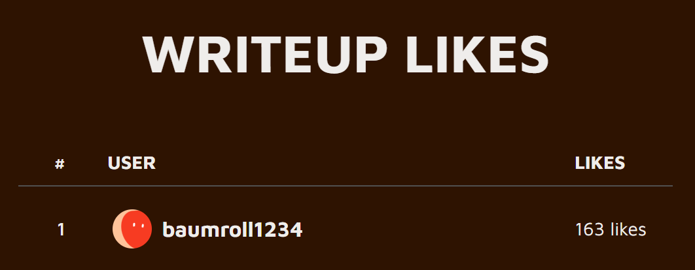

# Happy Birthday

「2周年」に「？？？」ってなりましたが、AlpacaHackってDailyが始まる前からあったんですね。

## 問題

AlpacaHack 2周年！誕生日おめでとう！

```py
FLAG = getenv("FLAG", "Alpaca{REDACTED}")

def H(m):
    return sha256(m).digest()[:5]

a = bytes.fromhex(input("user hex > "))
b = bytes.fromhex(input("admin hex > "))

ok = (
    a != b
    and a.startswith(b"user=")
    and b.startswith(b"admin=")
    and H(a) == H(b)
)

print(FLAG if ok else "nope")
```

## 概要

2つの16進数データ`a`,`b`の入力を求められます。

これらのバイナリ値がそれぞれ`user=`,`admin=`で始まり、かつこれらのハッシュ値の16進数の先頭5バイトが一致している場合、フラグをゲットできます。

元データが少しでも変わるとハッシュ値は大幅に変わってしまい、微調整もできませんが、どうすれば条件を満たす2つの入力の組を見つけられるのでしょうか？

## 解法

比較に使用しているのはハッシュ値の先頭5バイトなので、$`256^{5} = 1099511627776 (約1兆)`$通りあります。

いろいろな方法があるかと思いますが、私が考えたのは、`user=`から始まるデータのハッシュ値を例えば100万個生成しておいて、これにぶつかる`admin=`から始まるデータのハッシュ値を探す方法です。

この方法で答えが見つかるまでにどれくらいかかるのでしょうか？

前提として、ハッシュ値の先頭5バイトは1兆個の空間の中で一様に分布すると仮定します。

まず、`user=`から始まるものを100万個生成することで、1兆の中の100万分の1が満たされます。（いくつか被るでしょうけど誤差の範囲なので無視します。）

次に、`admin=`から始まる方を1個ずつぶつかるか見ていくと、100万分の1の確率で当たる抽選に繰り返し挑戦することになります。

そうすると、例えば100万回までに1回も当たらない確率は、$`0.999999^{1000000} = 0.36788`$となり、63.2%の確率でどこかでぶつかります。

もし100万回までに当たらなくても、200万回なら86.5%、300万回なら95.0%とどんどん上がっていくので、そのうちぶつかるでしょう。

というわけで、0, 1, 2, ... の整数を付けて試してみることにします。

```py
from hashlib import sha256

def H(m):
    return sha256(m).digest()[:5]

dict_a = {}
for i in range(1000000):
    a = f"user={i}".encode()
    dict_a[H(a)] = a

i = 0
while True:
    b = f"admin={i}".encode()
    h = H(b)
    if h in dict_a:
        a = dict_a[h]
        print(f"Found at {i=}.")
        print(f"{h = }")
        print(f"a: {a.hex()}")
        print(f"b: {b.hex()}")
        break
    i += 1
```

これを実行すると、私のパソコンでは2秒ちょっとで見つけることができました。

あとはここで得た`a`と`b`を実行して入力するか、これらをコピペした下記のプログラムを実行すれば、フラグを得ることができます。

```py
import pwn

# HOST, PORT = "localhost", 1337
HOST, PORT = "34.170.146.252", 32629
p = pwn.remote(HOST, PORT)
p.sendlineafter(b' > ', b'(aの16進数表記)')
p.sendlineafter(b' > ', b'(bの16進数表記)')
print(p.recvline())
```

## その他

それで、過去のAlpacaHackの情報を見てみると、大会とかも行われていたみたいですね。

そして、ふと、「Leaderboard」というところを見てみると、なんと、「WRITEUP LIKES」がトップになっていました！



いつも見ていただいてありがとうございます。
